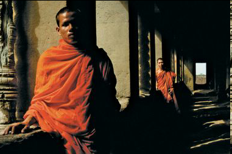

# Understanding Composition Field Guide

### Chapter 1

### Chapter 2

_**visual weight rule**:_ Visual weight can be described as the contrast between what is in focus and what is not in focus. Clearly, a difference exists. If something is in focus, it’s important; if it’s not in focus, then it’s not as important.

#### Storytelling compositions

When shooting storytelling compositions in which you want as much front-to-back sharpness as possible, try my foolproof formula:

1.Turn auto-focus off.

2. If you’re using a camera with a “crop factor” and a lens with a 75-degree angle of view \(18mm on the digital 18–55mm zoom\), set the aperture to f/22 and then focus on something approximately 6 feet \(2 meters\) from the lens.

3. If you’re in manual exposure mode, adjust your shutter speed until a correct exposure is indicated, then shoot. If you’re in Aperture Priority mode, simply shoot, since the camera will set the shutter speed for you. Your resulting depth of field will extend from about 3 feet \(1 meter\) to infinity.

4. If you’re using a 12–24mm digital wide-angle zoom, again on a crop-factor camera and with a focal length between 12mm and 16mm, set the lens to f/22 and then focus on something 3 feet \(1 meter\) away, then repeat step 3. Your resulting depth of field will be from approximately 14 inches to infinity.

5. Those of you shooting with a full-frame digital sensor and using focal lengths between 14mm and 24mm would simply focus at 3 feet \(1 meter\). When combined with an aperture of f/22, the resulting depth of field will again be from 14 inches to infinity. If you’re shooting with a focal length between 25mm and 28mm on a full-frame camera, set the focus distance to 6 feet \(2 meters\) and you’ll record a depth of field from 3 feet to infinity.

### Chapter 3: Filling the frame

* Once you think you have filled the frame with that flower or portrait of your friend, spouse, lover, neighbor, or stranger, ask yourself the following questions: Are the flower petals touching the edges of the frame inside your camera’s viewfinder? Is the person’s forehead cut off a bit at the top of your frame? If the answer to either question is “Nope!” then you are not yet close enough—so get closer!

### Chapter 4: Choosing your background

* When you are watching the final episode of your favorite television show, all your attention is on the TV—at least until crying is heard from the baby’s room in the “background.” Many times—and, oh my, do I mean _many_ times—I have seen potentially great compositions get compromised by that “baby crying in the background,” which, of course, distracts the viewer from focusing on the main subject.
* _**Do not shoot any composition where babies are crying in the background.**_

### Chapter 5: Using the empty canvas

Practice: Begin with the most basic of blank canvases, such a brick wall free of posters or graffiti, or the side of a barn. fill the frame with nothing more than the brick wall, the weathered wood of the barn. Now just stare at this empty canvas and ask yourself, “What can I now add to this canvas?”

### Chapter 6: Adding foreground

